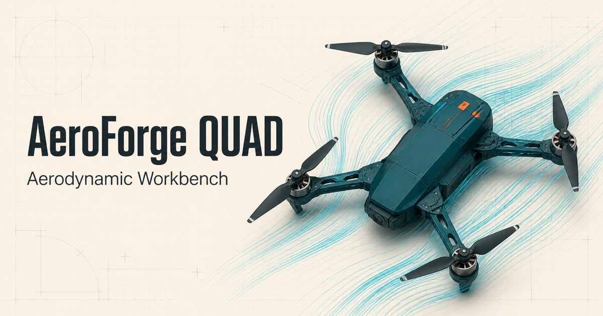
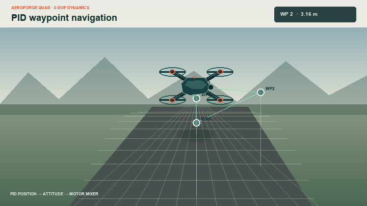
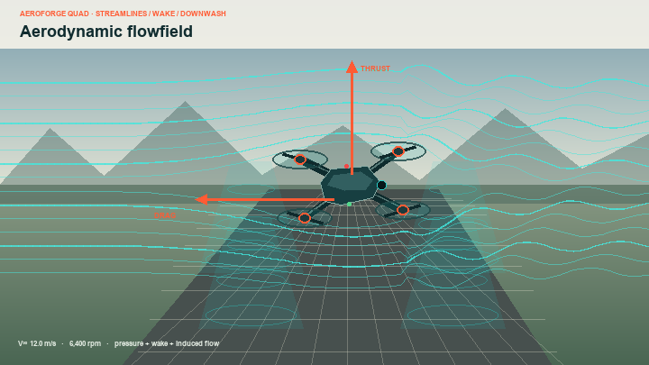
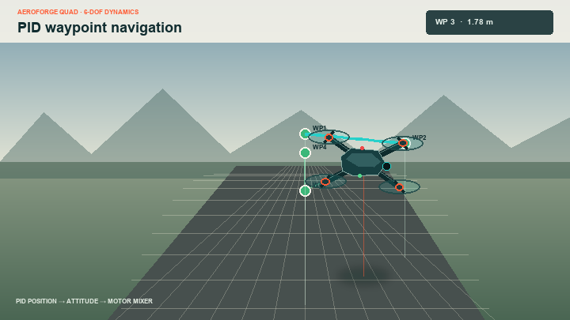

# AeroForge QUAD

Interactive aerodynamic and 6-DOF flight-dynamics simulator for quadcopters. Explore airflow, tune vehicle parameters, and watch a PID-controlled aircraft fly a three-dimensional waypoint mission—all in the browser.



## Waypoint navigation

The simulator integrates Newton–Euler rigid-body states in three dimensions and mixes four motor commands through a PID waypoint controller. Drag the scene to orbit the camera, zoom with the wheel, or switch between isometric, top, and chase views.



## Highlights

- Interactive 3D aerodynamic flow field with animated streamlines, rotor downwash, force vectors, terrain, depth cues, and a detailed quadcopter model
- Six-degree-of-freedom translation and rotation with Euler-integrated Newton–Euler dynamics
- PID waypoint following, manual motor mixing, live motor RPM, attitude, position, velocity, and mission status
- Adjustable airspeed, wind heading, pitch, rotor speed, propeller diameter, vehicle mass, reference area, and drag coefficient
- Live estimates for thrust, drag, power, endurance, Reynolds number, disk loading, force balance, and roll moment
- Exportable CSV data for downstream analysis
- Responsive, client-only Netlify production build—no backend required

## Visual model

| Aerodynamic flow field | 3D flight dynamics |
| --- | --- |
|  |  |

The aerodynamic panel uses the current vehicle and atmosphere settings to show relative flow, pressure accents, thrust, drag, and rotor wake. The dynamics panel maintains position, velocity, Euler attitude, and body-rate state while the controller advances through a spatial mission.

## Model overview

The current browser model is intentionally lightweight enough to run interactively:

- Dynamic pressure: `q = 1/2 rho V^2`
- Parasitic drag: `D = q C_d A`
- Rotor thrust: `T = C_t rho n^2 d^4`, summed across four rotors
- Body motion: translational and rotational Newton–Euler equations with gravity, body drag, motor torques, and lateral gust forcing
- Control: position/altitude PID loops mapped to collective thrust, roll, pitch, and yaw motor mixing

This is an engineering exploration and education tool. Its analytical estimates are not a substitute for CFD, wind-tunnel validation, hardware-in-the-loop testing, or flight-certification analysis.

## Run locally

Requirements: Node.js 22.13 or newer and pnpm.

```bash
git clone https://github.com/abhinav3/aeroforge-quad.git
cd aeroforge-quad
pnpm install
pnpm dev
```

Open [http://localhost:3000](http://localhost:3000), choose **PID WAYPOINT**, and press **RUN SIMULATION**.

To verify the same static production bundle used by Netlify:

```bash
pnpm run build:netlify
pnpm exec vite preview --outDir netlify-dist
```

## Deploy to Netlify

[Import this repository into Netlify](https://app.netlify.com/start/deploy?repository=https://github.com/abhinav3/aeroforge-quad). The included `netlify.toml` supplies the deployment settings automatically:

| Setting | Value |
| --- | --- |
| Build command | `pnpm run build:netlify` |
| Publish directory | `netlify-dist` |
| Node version | `22` |

Every subsequent push to the connected production branch will trigger a fresh deployment.

## Project layout

```text
app/                         Main simulator UI and dynamics model
netlify/                     Static production entry point
public/                      Site metadata and branding
docs/assets/                 README screenshots and animation
scripts/generate_readme_media.py
netlify.toml                 Netlify build configuration
vite.netlify.config.ts       Static Vite bundle configuration
```

The README media can be regenerated from the project model with:

```bash
python3 scripts/generate_readme_media.py
```

## License

Licensed under the terms in [LICENSE](LICENSE).
